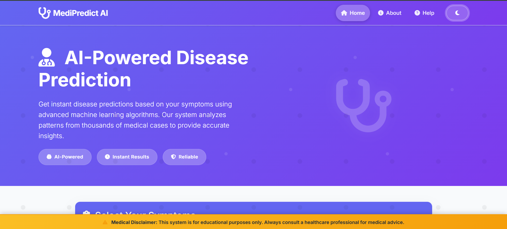
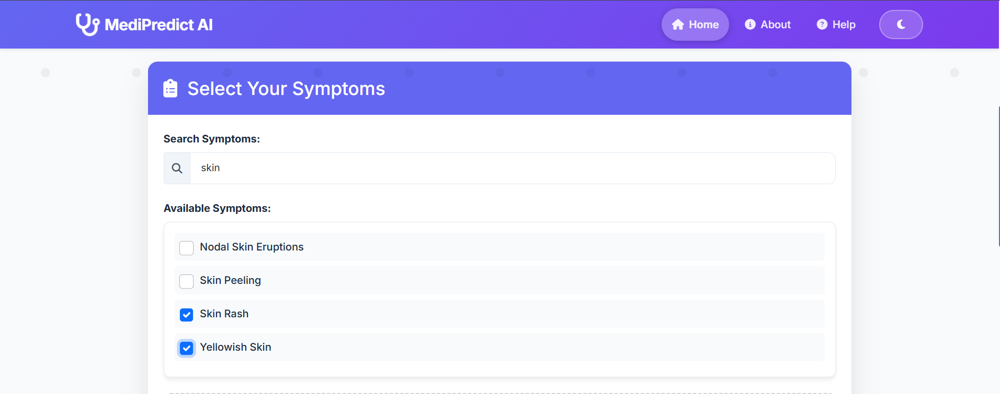
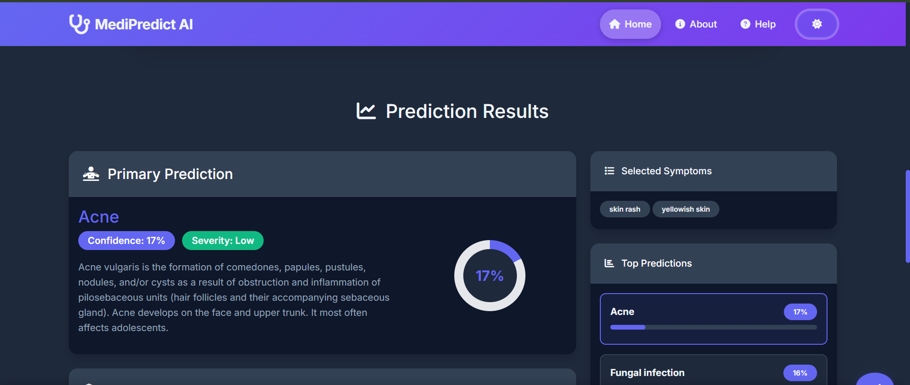
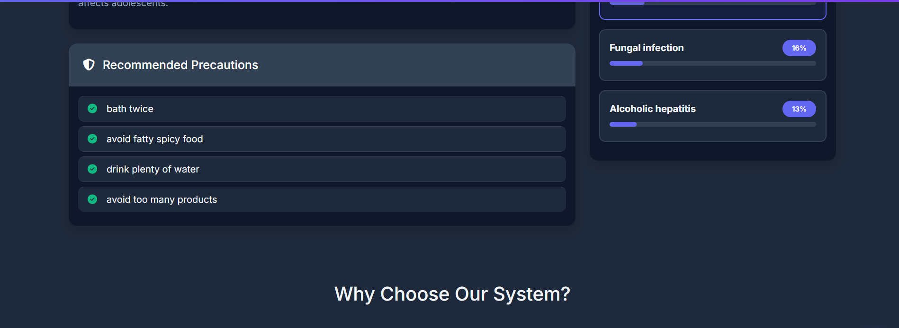

# 🧠 Disease Prediction from Symptoms

A web-based machine learning project that predicts diseases based on user-selected symptoms. Built with Python, Flask, and a trained ML model, the application provides predictions, precautions, and detailed information about diseases.

---

## 📸 Screenshots

### 🏠 Home Page

### 🤒 Symptoms Selection

### 🧪 Disease Prediction Output

### 💊 Precaution Suggestions

### ⚙️ Tech Stack Overview

---

## 🚀 Features

- Predicts disease based on selected symptoms.
- Shows disease description and severity.
- Provides precautions to follow.
- User-friendly interface built with HTML/CSS/JS and Flask.

---

## 🧰 Tech Stack

- **Frontend**: HTML, CSS, JavaScript
- **Backend**: Python, Flask
- **Machine Learning**: Scikit-learn
- **Data Handling**: Pandas, NumPy
- **Model Persistence**: Pickle (`.pkl`)
